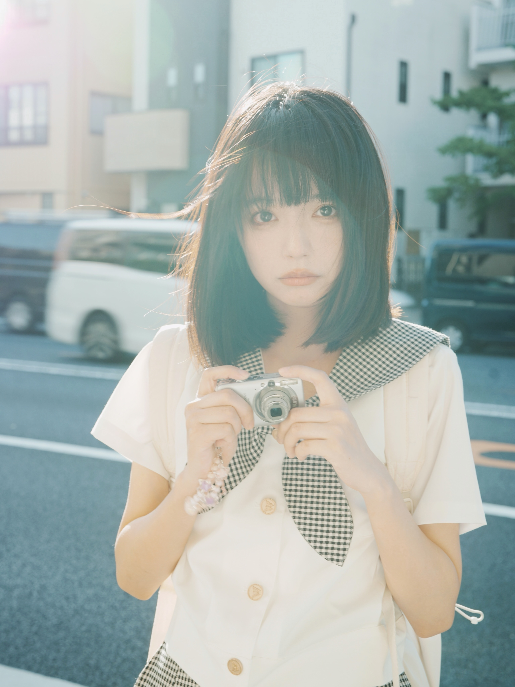
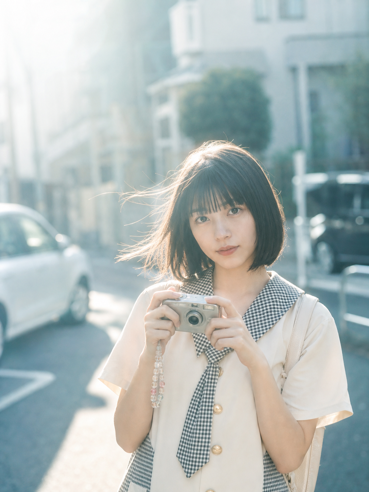
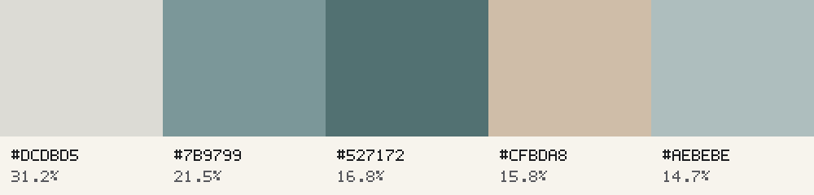

# Image Prompt Reverse

`image-prompt-reverse` v1.2 is a reusable Codex Skill that turns a reference image into an auditable GPT Image reconstruction bundle.

Given an attached image, the Skill:

1. inspects the reference and measures its dimensions, aspect ratio, tonal profile, and representative colors;
2. creates both a five-color palette and a deterministic blurred map of spatial color and luminance placement;
3. writes a step-by-step reverse-engineering report;
4. extracts one executable English GPT Image prompt from the report;
5. calls the built-in GPT image-generation tool using the prompt plus the blurred map, never the original image;
6. compares the generated image with the reference; and
7. returns the original, palette, color map, report, prompt, generated image, and verification manifest together.

## Example: Sunlit Camera Portrait

The reconstruction below was generated from the extracted text prompt plus a detail-suppressed color-distribution map. GPT Image did not receive the original image; the map carries only coarse color and luminance placement.

<table>
  <tr>
    <th width="50%">Input reference</th>
    <th width="50%">Prompt + blurred-color-map reconstruction</th>
  </tr>
  <tr>
    <td width="50%"></td>
    <td width="50%"></td>
  </tr>
</table>

The reconstruction preserves the direct gaze, compact-camera pose, black bob and bangs, gingham-trimmed ivory outfit, backlit street setting, and muted cream-and-teal palette. The blurred map helps retain the pale upper field, cool left side, dark middle-right mass, and warm lower center. Its clearest deviation remains a cleaner exposure with less of the original's broad cyan-white veiling flare.



### Detail-suppressed spatial color reference

<p align="center">
  
</p>

A flat palette records which colors dominate; the blurred map records where those color and luminance fields sit. The analyzer collapses the image into a coarse spatial grid, blurs it twice, and smoothly reconstructs it to suppress readable text, faces, and object detail before generation.

Explore the complete audit trail:

- [Step-by-step reverse-engineering report](./examples/sunlit-camera-portrait/reverse-engineering.md)
- [Extracted GPT Image prompt](./examples/sunlit-camera-portrait/gpt-image-prompt.txt)
- [Objective image analysis](./examples/sunlit-camera-portrait/image-analysis.json)
- [Verified bundle manifest](./examples/sunlit-camera-portrait/bundle-manifest.json)

## Install

Ask Codex to install the Skill from:

```text
https://github.com/Lanzy1029/image-prompt-reverse/tree/main/skills/image-prompt-reverse
```

For manual installation, copy `skills/image-prompt-reverse` into your Codex skills directory:

```bash
mkdir -p ~/.codex/skills
cp -R skills/image-prompt-reverse ~/.codex/skills/
```

You can also download `release/image-prompt-reverse.skill.zip`, extract it, and place the resulting `image-prompt-reverse` directory under `~/.codex/skills/`.

## Use

Attach an image and ask:

```text
Use $image-prompt-reverse to reverse-engineer this image and generate a reconstruction guided by its blurred color map.
```

The Skill creates a new directory under `promptgen-output/` containing:

```text
original-image.<ext>
color-palette.png
color-distribution-map.png
image-analysis.json
reverse-engineering.md
gpt-image-prompt.txt
generated-image.<ext>
bundle-manifest.json
```

## Requirements

- Codex with image viewing and the built-in GPT image-generation tool.
- Python 3.10 or newer.
- At least one supported image decoder: Pillow, FFmpeg, or ImageMagick.

No OpenAI API key is required for the default built-in generation path. The reconstruction stage sends the extracted text prompt and the detail-suppressed color-distribution map to the image-generation tool. It never attaches the original image.

## Repository layout

```text
skills/image-prompt-reverse/  Installable Skill source
examples/                     Complete verified example bundle
release/                      Downloadable Skill archive
```

This repository includes one demonstration bundle. Only add or redistribute reference images when you have permission to publish them.

## License

MIT
